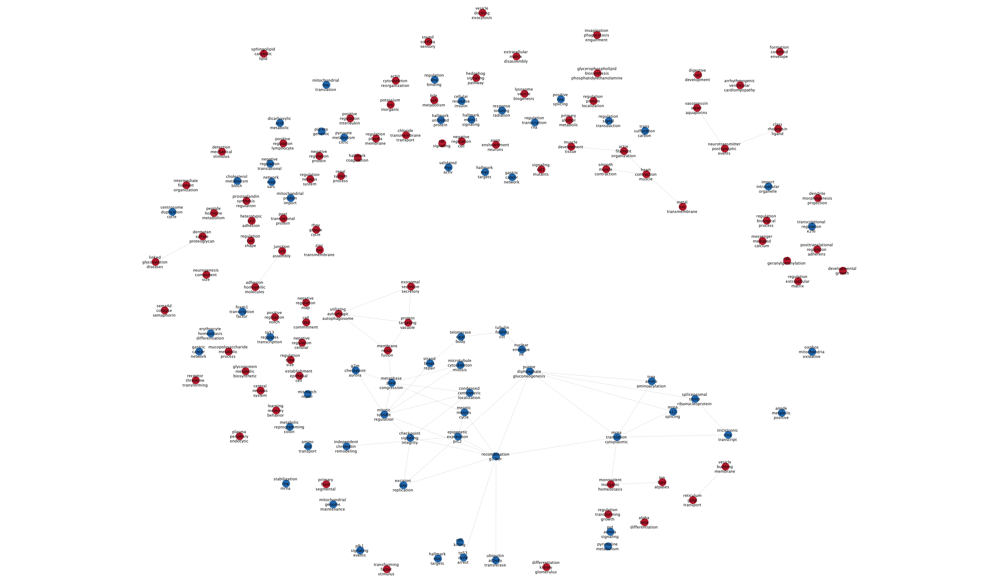
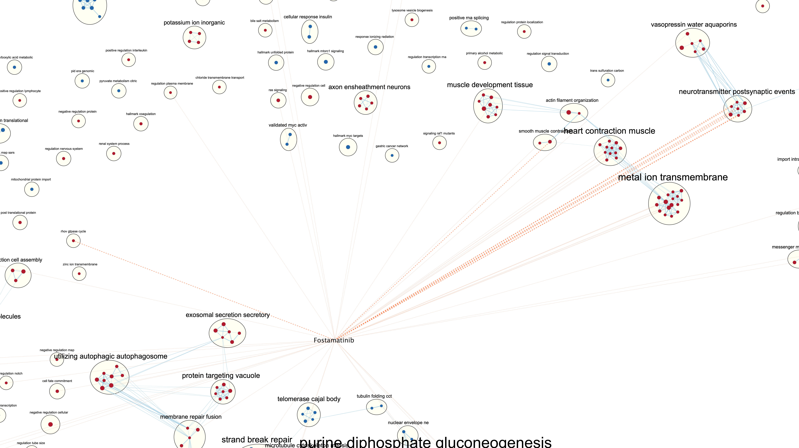

# A1/A2 Recap
```{r, child=c('a1_a2_recap.Rmd'), warning=FALSE, message=FALSE}
```


# A3: Data set Pathway and Network Analysis

## Important note for further interpretation

As mentioned also in A2, **note that NEDD9 is in the up-regulated gene because I ran the analysis backwards NEDD9 silenced (shNEDD9 condition) vs Control (shNTC condition) instead of control vs silenced.** This is important for interpretation since the positive enrichment will mean more expressed in the NEDD silenced condition and negative enrichment will mean less expressed in the NEDD silenced condition. Essentially, the results should be interpretated backwards from the conventional Control vs Silenced model. 

## Non-thresholded Gene set Enrichment Analysis

### Creating Ranked Genes List
First, we will create a ranked set of genes according to the GSEA format from our ranked genes list in A2 as we did not create one in A2.

```{r, warning=FALSE, message=FALSE}
qlfOutputHits$table[, "rank"] <- -log(qlfOutputHits$table$PValue, base = 10) * sign(qlfOutputHits$table$logFC)
qlfOutputHits$table <- merge(dataIdConversion, qlfOutputHits$table, by.x = 1, by.y = 0, all.y=TRUE)
qlfOutputHits$table <- qlfOutputHits$table[order(qlfOutputHits$table$rank, decreasing = TRUE),]

ranked_genes_list <- data.frame(GeneName = qlfOutputHits$table$hgnc_symbol, rank = qlfOutputHits$table[,"rank"])

write.table(x=ranked_genes_list, file="ranked_genes_list.rnk",sep = "\t", row.names = FALSE, quote = FALSE)

kable(head(ranked_genes_list), type = "html", row.names = FALSE, caption = "Table 1: Ranked Genes List for GSEA")
```

### Download geneset database from Bader Lab

Now we will download the required geneset from Bader Lab for GSEA input. Note that we will use HUGO gene symbols that we matched in A1 for our gene identifier as GSEA will expect HUGO symbols because our geneset database is annotated in HUGO symbols.

```{r, warning=FALSE, message=FALSE}
if (!requireNamespace("RCurl", quietly = TRUE)){
  install.packages("RCurl")
}
library(RCurl)

gmt_url <- "http://download.baderlab.org/EM_Genesets/current_release/Human/symbol/"
filenames <- getURL(gmt_url)
tc <- textConnection(filenames)
contents <- readLines(tc)
close(tc)
rx <- gregexpr("(?<=<a href=\")(.*.GOBP_AllPathways_no_GO_iea_.*.)(.gmt)(?=\">)",
              contents, perl = TRUE)
gmt_file <- unlist(regmatches(contents, rx))
if (!file.exists(paste("data/", gmt_file, sep = ""))){
  dest <- file.path(paste(getwd(), "data", sep = ""), gmt_file)
  download.file(paste(gmt_url,gmt_file,sep=""), destfile=dest)
}
```

### Running GSEA

For the Non-thresholded Gene set Enrichment Analysis, I will be using the GSEA Preranked method of GSEA software version 4.2.3. I will be running GSEA 4.2.3 on my local laptop (M1 Mac) with the following parameters:

* Required Fields:
  * Gene set database: Bader Lab Geneset from April 2022
  * Number of Permutations: 1000
  * Ranked list: ranked_genes_list
  * Collapse/ Remap: No collapse
* Basic Fields:
  * Max size: 200
  * Min size: 15

### GSEA Results

#### Missing GeneName Warnings

As there were missing HUGO symbols for geneIds (check A1 Mapping Data Section for detail), GSEA gave a warning saying 75 genes were ignored due to N/A values. I decided to move on with the warnings as these genes were only a very small part of the data, but I will take a note of this for our future analysis. Please let me know if there are better methods to handle this. 

#### Positive Enrichment Score Results Summary

Table 2 shows a summary of the top gene sets for positive enrichment from the GSEA analysis. From the result, we see the top positive enrichment results are related to exocytosis, extracellular structure organization and regulation of exocytosis. 

```{r}
gsea_pos_results <- read.delim("gsea_report_for_na_pos.tsv", row.names = NULL)
gsea_pos_results <- data.frame(name = gsea_pos_results$NAME, size = gsea_pos_results$SIZE, ES = gsea_pos_results$ES, NES = gsea_pos_results$NES, NOM_p_val = gsea_pos_results$NOM.p.val, FDR_q_val = gsea_pos_results$FDR.q.val, FWER_p_val = gsea_pos_results$FWER.p.val, rank_at_max = gsea_pos_results$RANK.AT.MAX, leading_edge = gsea_pos_results$LEADING.EDGE)
kable(head(gsea_pos_results), type = "html", row.names = FALSE, caption = "Table 2: GSEA Positive Enrichment Results")
```


#### Negative Enrinchment Score Results Summary

Table 3 shows a summary of the top gene sets for negative enrichment from the GSEA analysis. From the result, we see the top negative enrichment results are related to various translations and translation initiation. 

```{r}
gsea_neg_results <- read.delim("gsea_report_for_na_neg.tsv", row.names = NULL)
gsea_neg_results <- data.frame(name = gsea_neg_results$NAME, size = gsea_neg_results$SIZE, ES = gsea_neg_results$ES, NES = gsea_neg_results$NES, NOM_p_val = gsea_neg_results$NOM.p.val, FDR_q_val = gsea_neg_results$FDR.q.val, FWER_p_val = gsea_neg_results$FWER.p.val, rank_at_max = gsea_neg_results$RANK.AT.MAX, leading_edge = gsea_neg_results$LEADING.EDGE)
kable(head(gsea_neg_results), type = "html", row.names = FALSE, caption = "Table 3: GSEA Negative Enrichment Results")
```

### Thresholded Analysis results vs Non-thresholded Analysis results

For the positive enrichment results, we see the top terms of the thresholded analysis results are related to signaling and Membrane Trafficking; while top terms of the non-thresholded analysis results are related to exocytosis, extracellular structure organization. There is minimal similarity between the two results as the top results are mostly different between the Thresholded and Non-thresholded analysis.

<br>

However, the negative enrichment results from the thresholded and non-thresholded analysis are quite similar. Both thresholded and non-thresholded analysis top results are related to translation. The main difference I noticed was that the non-thresholded analysis results were more specific (ex. CAP-dependent translation) while the thresholded analysis result only mentions "translation".

<br>

The comparison doesn't seem to be straightforward comparison as non-thresholded takes account of all genes (hence non-thresholded) while thresholded analysis only takes genes that pass the threshold. In addition, the 75 genes ignored in GSEA make it seem like a not straightforward comparison as these genes were used in thresholded analysis (as g:profiler used gene ids and not the mapped hugo symbols). 

## Data set Pathway and Network Analysis

### Creating Enrichment Map and Used Parameters

Cytoscape 3.9.1 [@shannon2003cytoscape] with the Enrichment Map plugin 3.3.3 [@merico2010enrichment] was used for creating the enrichment map. The following parameters/thresholds were used to creat the enrichment map:

* P-value: 0.005
* FDR Q-value: 0.075
* Overlap (edge): 0.5

I decided to use these thresholds as it was recommended in the enrichment map manual for moderately conservative thresholds.

The enrichment map before manual layout:
<br>


### Annotating the Network

For annotating the network I used the AutoAnnotate plugin [@kucera2016autoannotate] to cluster and annotate the network with the following parameters:

* Quick Start Annotation
  * Annotate entire network
  * Layout network to prevent cluster overlap
  * Label column: GS_DESCR

I annotated the entire network to not miss out on some nodes, but I could always manually hide some small clusters that I don't need later on for a clearer image.

### Publication ready figure

The publication ready figure was created with the publication-ready option with all annotations:
<br>


### Theme Network

The network was collapsed into a theme network using the AutoAnnotate Create Summary Network functionality with all nodes/clusters collapsed. Theme network:

<br>



<br>
Main themes include translation, signaling and mitosis/meiosis cycles. The main themes don't exactly fit with the model of over-expression NEDD9 causing prostate cancer progression  and metastasis. However, themes such as signaling, cell cycles and translation may be part of promoting cancer growth and metastasis. Lastly, I don't notice any novel pathways/themes present in the theme network.

## Interpretation

**Do the enrichment results support conclusions or mechanism discussed in the original paper? How do these results differ from the results you got from Assignment #2 thresholded methods.**

The enrichment results do not directly support the conclusions or mechanism discussed in the original paper, but do show some relevance to the conclusions. The original paper states that NEDD9 gene is suspected to play a role in tumor growth / metastasis for prostate cancer[@han2021susceptibility]. From the enrichment analysis, we see results related to translation, cell cycle regulation and signaling pathways that may be relevant to prostate cancer growth and metastasis. However, I believe this is not enough to completely conclude that the enrichment results really support the conclusions discussed in the paper.

<br>

Comparing the GSEA results with the thresholded analysis results from A2, there is high similarity between the negative enrichment results and minal similarity between the positive enrichment results. Both thresholded and non-thresholded negative enrichment results show **translation** as the top results showing similarity. However, the positive enrichment results differ between the non-tresholded and thresholded results as thresholded top results show **signalling** and **membrane trafficking**, meanwhile non-thresholded top results show *exocytosis* and **extracellular structure organization**.

<br>

**Can you find evidence, i.e. publications, to support some of the results that you see. How does this evidence support your result?**

From doing more research, I found that the mechanism of how NEDD9 regulates metastasis and cancer growth is largely unknown [@shagisultanova2015preclinical] which is the reason why I can't completely conclude that the enrichment results support the conclusion that NEDD9 promotes metastasis/cell invasion. However, the paper NEDD9/Arf6-dependent endocytic trafficking of matrix metalloproteinase 14 [@shagisultanova2015preclinical], discusses the role of NEDD9 in redistribution of MMP14 to the cell surface (extra-cellular structure organization) and trafficking which support some main results (signalling, membrane trafffiking and extracellular structure organization) from the enrichment analysis.


## Post Analysis: Drug Target

### Geneset and Parameters
I will be adding a post analysis to the main network using the drug bank gene set to find potential drugs related to our network. I decided to add drugs for post-analysis to see if any cancer/metastasis related drugs will come out as top hits to support conclusions from the original paper. In addition, I was generally curious if any drug related to the target NEDD9 gene will come up as a top result.

<br>

The following gene set and parameters were used for adding the post analysis:

* Gene set
  * The Bader lab **Human_DrugBank_approved_symbol.gmt** gene set from April 2022 was used for post analysis to find approved drugs that may be relevent to our analysis.
  * Loaded from web.
* Edge Weight Parameter
  * Mann-Whitney (One Sided Greater)
  * Cutoff 0.05

### Post Analysis Results

A total of 161 gene sets out of 1972 gene sets passed the Mann-Whitney (One Sided Greater) cutoff of 0.05. The top hits are shown in Figure 4. below with fostamatinib as the top result.


<br>

For the network, I only added the top hit Fostamatinib in the network for clarity and because most drugs were not very relevent with the mechanism dicussed in the paper: Susceptibility-associated genetic variation in NEDD9 contributes to prostate cancer initiation and progression [@han2021susceptibility]. The snapshot of the network with added post analysis is shown in Figure 5.



<br>

Taking a more detailed look into Fostamatinib in DrugBank, Fostamatinib is a tyrosine kinase inhibitor used to treat chronic immune thrombocytopenia [@wishart2018drugbank]. Although the original paper [@han2021susceptibility] discusses the potential role of the NEDD9 gene in prostate cancer and not chronic immune thrombocytopenia, it is interesting to see Fostamatinib as the top result as sources such as sources such as GeneCards [@szklarczyk2015string] show NEDD9's role in chemokine-induced T cell migration and T cell receptor (TCR)–mediated integrin activation.

The post-analysis did not show support for the mechanism/conclusions made in the original paper, but did support other NEDD9 mechanisms discussed in papers such as Preclinical and clinical studies of the NEDD9 scaffold protein in cancer and other diseases [@szklarczyk2015string]. In addition, the post-analysis result aligns with the NEDD9 gene description from GeneCards [@szklarczyk2015string].


# Used Packages/Applications for Analysis
Packages/Applications used: Biomanager[@cattley2007biomanager], GEOmetadb[@geoquerypackage], BioMart[@durinck2005biomart], knitR[@xie2018knitr], Circlize[@gu2014circlize], ComplexHeatmaps[@gu2016complex], Limma[@ritchie2015limma], edgeR[@robinson2010edger], GSEA[@subramanian2007gsea], cytoscape[@shannon2003cytoscape], RCurl[@lang2007r].

# Citations


